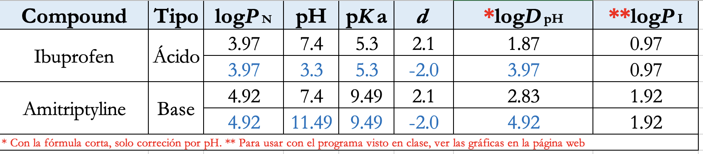
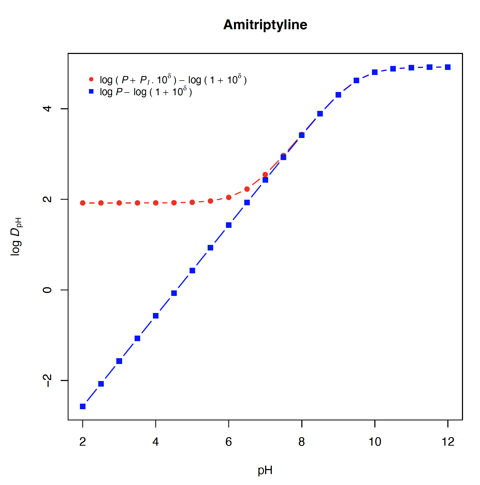

```{r setup, include=FALSE}
knitr::opts_chunk$set(echo = FALSE)
```

1. Tabla con los valores de propiedades fisicoquímicas para el cálculo del logD

{width=400}


2. Perfil de logD para el Ibuprofeno

{width=300}

3. Perfil de logD para la amitriptilina

{width=300}


